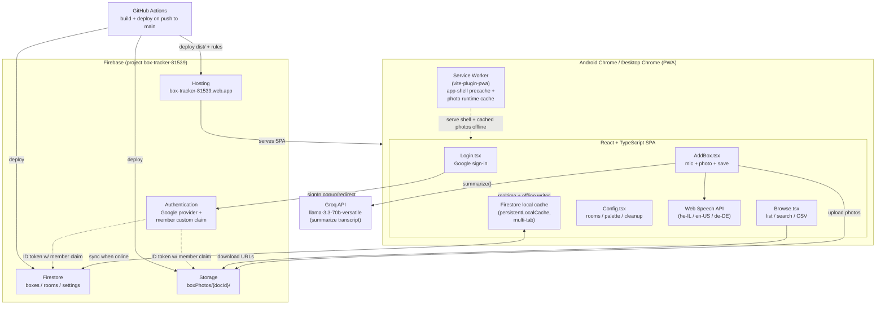

# BoxIndex — Architecture

System overview for the BoxIndex PWA. See [SPEC.md](../SPEC.md) for the authoritative
detail and [auth-flow.md](./auth-flow.md) for the Google sign-in flow and manual setup.

## High-level architecture

## Components

| Layer | Piece | Responsibility |
|---|---|---|
| Shell | `App.tsx` | Auth gate (`onAuthStateChanged` + `member` claim), screen routing, history/back handling, offline banner, header (avatar + sign-out). |
| Screens | `Login` / `AddBox` / `Browse` / `Config` / `Nav` | The four screens (SPEC 6) plus responsive navigation. |
| Data | `src/data/*` | `boxes`, `rooms`, `palette`, `photos`, `csv`, `confirmPrefs` — Firestore/Storage access and CSV logic. |
| Hooks | `src/hooks/*` | `useBoxes`, `useRooms`, `usePalette`, `useOnline`, `useSpeechRecognition`, etc. — realtime subscriptions and device state. |
| Services | `firebase.ts` | Initializes app, `auth`, `db` (with offline cache), `storage`, `googleProvider`. |
| Services | `llm.ts` | `summarize(transcript)` → Groq; passthrough if no key. |

## Data stores

- **Firestore** — `boxes`, `rooms`, `settings` collections (SPEC 4, 6.5). Offline persistence via
  `persistentLocalCache` + `persistentMultipleTabManager`; box numbering reads from this cache so it works offline.
- **Storage** — photos under `boxPhotos/{docId}/`, keyed by a client-generated `docId` created when the Add Box form opens.
- **localStorage** — per-device confirmation-prompt toggles (SPEC 6.5), never synced to Firestore.

## Trust boundary

Both Firestore and Storage rules gate on `request.auth.token.member == true` — the only check both rule
engines can read (Storage cannot read Firestore). Being signed in with any Google account is not enough;
the `member` claim is granted per account out-of-band via `scripts/setMember.js`. See [auth-flow.md](./auth-flow.md).
