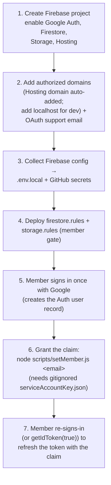

# BoxBuddy — Authentication

Google sign-in only, gated by a `member` custom claim. See [SPEC.md](../SPEC.md) sections 5, 6.1, and 10.

## Why a custom claim (not just "signed in")

The repo is public and the audience is a closed set of 4 family accounts. `request.auth != null` would let
*any* Google account in. Instead the Firestore/Storage rules require `request.auth.token.member == true`. A
custom claim is the only mechanism **both** rule engines can read (Storage rules cannot read Firestore), so one
check secures both services, and no email addresses ever appear in committed source.

## Manual one-time setup (pre-steps)

These steps are done once, by hand, outside the app. They are prerequisites for sign-in to work.



Notes:
- Step 6 fails with `auth/user-not-found` if the member has not done step 5 first.
- Revoke access later with `node scripts/setMember.js <email> --revoke` (or delete the user in the Console).
- The service-account key is **gitignored and never committed** — the repo is public.

## Runtime sign-in flow (hybrid popup/redirect)

`Login.tsx` picks the method by device: `useRedirect = /Android/i.test(navigator.userAgent)`.
- **Android** (primary target): `signInWithRedirect` — popups are unreliable in the standalone PWA.
- **Desktop/laptop** (incl. localhost dev, shared laptop): `signInWithPopup` — the redirect flow silently
  fails there (Chrome storage partitioning loses the result, dropping the user back on Login with no error).

Either way the `prompt: 'select_account'` parameter forces the account chooser, and the member-claim gate
runs centrally in `App.tsx`.

```mermaid
sequenceDiagram
  participant U as User
  participant L as Login.tsx
  participant G as Google OAuth
  participant A as App.tsx (auth gate)
  participant FB as Firebase Auth

  U->>L: Click "Sign in with Google"
  alt Android
    L->>G: signInWithRedirect (prompt=select_account)
    G-->>A: redirect back; getRedirectResult()
  else Desktop / laptop
    L->>G: signInWithPopup (prompt=select_account)
    G-->>L: popup resolves
  end
  FB-->>A: onAuthStateChanged(user)
  A->>FB: getIdTokenResult(user)
  alt claims.member === true
    A->>A: setUser(user) → route to Add Box
  else missing claim
    A->>FB: signOut()
    A->>L: show "This account isn't authorized to use BoxBuddy."
  end
```

## After sign-in

- The header shows the user's Google **profile photo** in a circle (falls back to an initial), plus a sign-out button.
- Each box records `addedBy` = the user's email for change tracking (SPEC 4.1).
- Auth state persists per device, so members stay signed in on their own phone.
